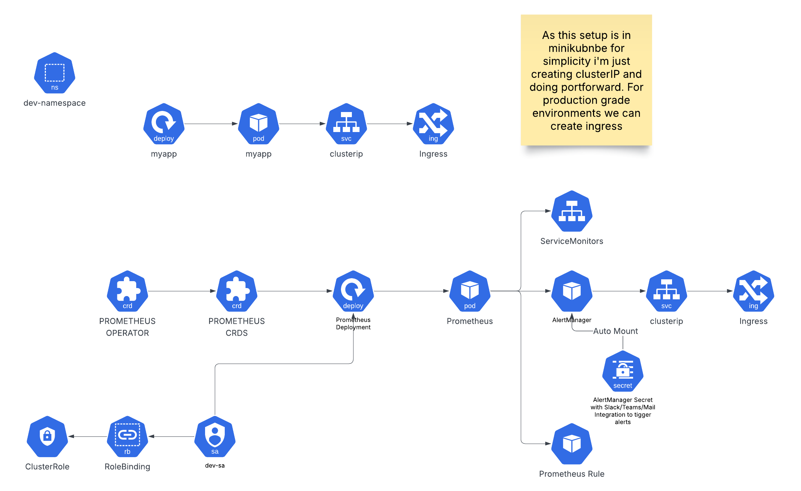

# Kubernetes Monitoring Setup with Prometheus & Alertmanager

This repository documents the setup of a Kubernetes monitoring stack using **Prometheus Operator**, **Prometheus**, **Alertmanager**, and **ServiceMonitors**, designed to monitor applications in multiple namespaces within a single Minikube cluster.

## 📦 Components

- **Prometheus Operator**: Manages Prometheus, Alertmanager, and associated CRDs.
- **Prometheus**: Deployed per namespace to collect metrics.
- **ServiceMonitor**: Custom resource to define how services should be scraped.
- **Alertmanager**: Handles alert notifications (e.g., to Slack).
- **Kubernetes Namespaces**: Each namespace contains its own Prometheus + monitored app.

## 🗂️ Namespaces Structure

- `development`
  - Application: `myapp-development`
  - Service: `dev-service` (port `8080`)
  - Prometheus Instance: `prometheus-dev`
  - Alertmanager Instance: `dev-alertmanager`
- `mlab02`
  - Application: `myapp-mlab02`
  - Service: `mlab02-service` (port `8081`)
  - Prometheus Instance: `prometheus-mlab02`
  - Alertmanager Instance: `mlab02-alertmanager`

## Flowchart


- https://lucid.app/lucidchart/b52e7283-035f-4485-a1a9-dde5c061d019/edit?viewport_loc=-1726%2C-100%2C3348%2C1326%2C0_0&invitationId=inv_2d50fa6c-e912-4433-acb0-495c3319e94e

## 🔧 Key Configuration

### Prometheus CRD

```yaml
apiVersion: monitoring.coreos.com/v1
kind: Prometheus
metadata:
  name: prometheus-dev
  namespace: development
spec:
  serviceMonitorSelector:
    matchLabels:
      release: prometheus
  serviceMonitorNamespaceSelector:
    matchLabels:
      kubernetes.io/metadata.name: development
  ruleSelector:
    matchLabels:
      role: alert-rules
  alerting:
    alertmanagers:
      - namespace: development
        name: alertmanager
        port: 9093
```

### Alertmanager ConfigMap

```yaml
apiVersion: v1
kind: ConfigMap
metadata:
  name: alertmanager-dev-alertmanager
  namespace: development
  labels:
    alertmanager: dev-alertmanager
data:
  alertmanager.yaml: |
    global:
      resolve_timeout: 5m
    route:
      group_by: ['alertname']
      receiver: "slack-notifications"
    receivers:
      - name: "slack-notifications"
        slack_configs:
          - api_url: "<your-slack-webhook>"
            channel: "#all-prometeus-alerts"
```

### Sample PrometheusRule

```yaml
apiVersion: monitoring.coreos.com/v1
kind: PrometheusRule
metadata:
  name: instance-down-rule
  namespace: development
  labels:
    role: alert-rules
spec:
  groups:
    - name: instance.rules
      rules:
        - alert: InstanceDown
          expr: up == 0
          for: 2m
          labels:
            severity: critical
          annotations:
            summary: "Instance {{ $labels.instance }} is down"
            description: "No response from {{ $labels.instance }} for 2 minutes"
```

## ✅ How to Access Prometheus / Alertmanager UI

Use `kubectl port-forward` to access UIs locally:

```bash
kubectl port-forward svc/prometheus-operated -n development 9090:9090
kubectl port-forward svc/alertmanager -n development 9093:9093
```

Open in browser:

- Prometheus UI: [http://localhost:9090](http://localhost:9090)
- Alertmanager UI: [http://localhost:9093](http://localhost:9093)

## 🧪 Alert Testing

To test the `InstanceDown` alert:
- Scale down the app pod to 0
```bash
kubectl scale deployment myapp-development --replicas=0 -n development
```
- Wait 2 minutes for alert to trigger

## 📝 To-Do

- [ ] Add persistent volume for Prometheus data
- [ ] Integrate `Promxy` for multi-namespace aggregation
- [ ] Visualize data using Grafana
- [ ] Configure more detailed alerting rules

---

